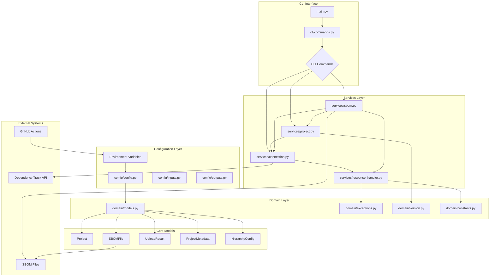
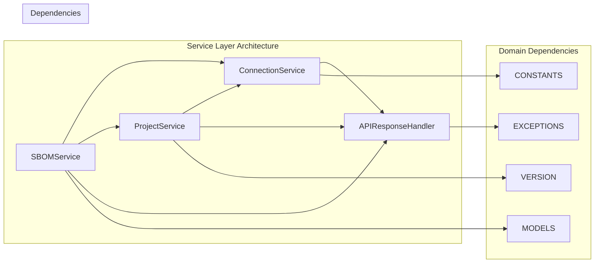
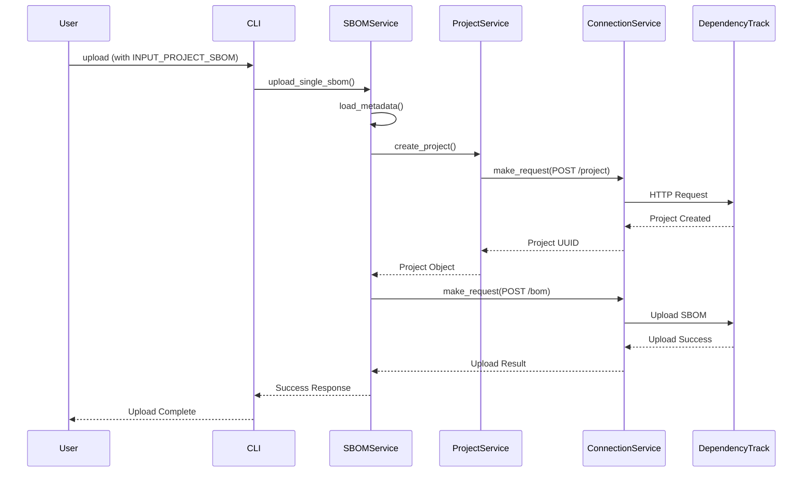
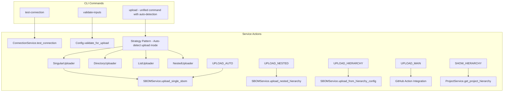
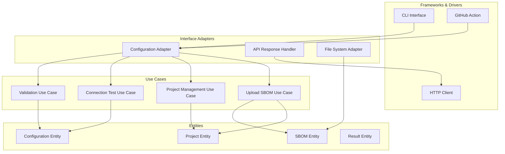
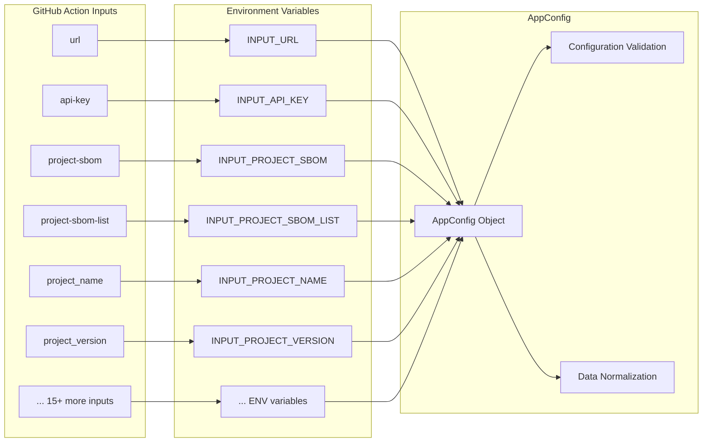
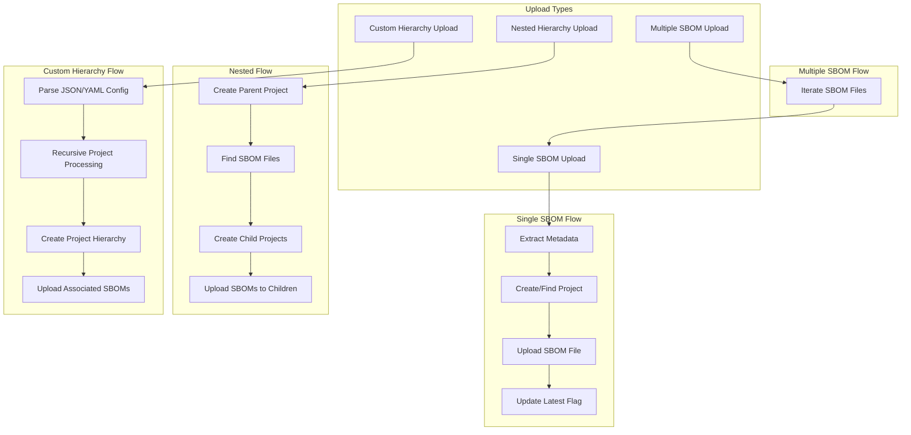

# SBOM Upload Action - Architecture Map

## 🏗️ System Architecture

## 🔄 Service Dependencies

## 📊 Data Flow

## 🎯 CLI Commands Flow

## 🏛️ Clean Architecture Layers

## 🔐 Configuration & Environment

## 🎯 Upload Scenarios

## 📦 File Structure Overview

```mermaid
graph TD
    subgraph "Project Structure"
        ROOT[sbom-upload/]
        SRC[src/]
        DOCS[docs/]
        TESTS[tests/]
        ACTION[action.yaml]
        README[README.md]
    end
    
    subgraph "Source Code"
        SRC --> CLI_DIR[cli/]
        SRC --> CONFIG_DIR[config/]
        SRC --> DOMAIN_DIR[domain/]
        SRC --> SERVICES_DIR[services/]
        SRC --> MAIN_PY[main.py]
    end
    
    subgraph "Documentation"
        DOCS --> USAGE[USAGE_EXAMPLES.md]
        DOCS --> QUICKSTART[QUICKSTART.md]
        DOCS --> CLI_DOC[CLI.md]
        DOCS --> HIERARCHY[HIERARCHY_CONFIG.md]
        DOCS --> WORKFLOW[PRE_MERGE_WORKFLOW.md]
    end
    
    subgraph "Test Files"
        TESTS --> SINGLE_SBOM[single_sbom/]
        TESTS --> MULTIPLE_SBOM[multiple_sbom/]
        TESTS --> HIERARCHY_EXAMPLE[hierarchy-example.json]
        TESTS --> DOCKER[docker/]
        TESTS --> TEST_SCRIPTS[test scripts]
    end
```

